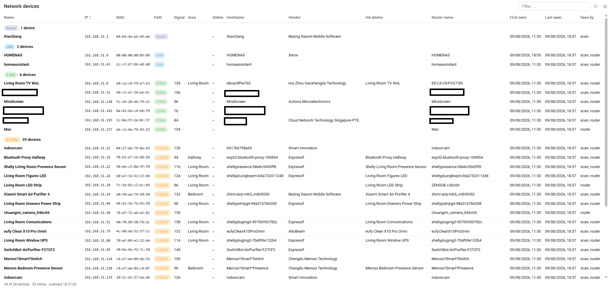

# Network Info

A Home Assistant integration that discovers **every device on your network** — not just
the ones Home Assistant knows — remembers everything it has ever seen, and shows which
path each device uses: **LAN, 2.4 GHz or 5 GHz Wi-Fi**. Ships its own table card.

Scanning works with zero credentials; give it your router's admin password and every
device also gets its connection path, signal level and the router's name for it.



## Highlights

- **Finds everything**: an nmap sweep of your subnet unioned with the router's client
  list — devices that block ping are still found via the router, silent wired devices
  via the scan ([details](docs/scanning.md)).
- **Connection path per device** — LAN / 2.4 GHz / 5 GHz / guest, plus signal level,
  read from the router's own API. Router brands are pluggable providers behind one
  interface; Xiaomi/MiWiFi and Technicolor (Homeware) are implemented
  ([details](docs/routers.md)).
- **The integration owns the memory**: every device ever seen is stored with first- and
  last-seen timestamps and stays listed when it goes offline — surviving restarts and
  working identically in scan-only mode. The router only enriches the list
  ([details](docs/scanning.md#device-memory)).
- **Knows your Home Assistant**: discovered devices are matched against the HA device
  registry, so they show up with their HA names and areas; HA's own IP is detected and
  pre-fills the whole setup form.
- **Cards included** — a device table (filterable, sortable, per-browser column
  settings, optional grouping into 2.4 GHz / 5 GHz / LAN sections, scan-on-demand) and
  an external IP log table (filterable, sortable, paginated). Registered as dashboard
  resources automatically ([details](docs/cards.md)).
- **External IP tracking, opt-in** — the public IP as a sensor and a persistent change
  log with timestamps; `api.ipify.org` is the integration's only internet call, made
  only when enabled ([details](docs/entities.md)).
- **No configuration homework** — add the integration, accept the pre-filled subnet,
  done. The router password is optional and everything degrades cleanly without it.

## Install

**HACS** → three-dot menu → _Custom repositories_ → add
`https://github.com/Oose97/ha-network-info` as an **Integration**, then download it and
restart Home Assistant.

**Manually**: copy `custom_components/network_info` into your `config/custom_components/`
and restart.

Then _Settings → Devices & Services → Add Integration → Network Info_. The scan range
and router address come pre-filled — see [Setup](docs/setup.md).

Requires Home Assistant 2024.12+ and the `nmap` executable (bundled with Home Assistant
OS and Container images). Connection-path info needs a supported router —
Xiaomi/MiWiFi or Technicolor (Homeware) — and its admin credentials.

## Documentation

### Setup

Go to [Setup](docs/setup.md) for more details.

- Two steps: the basics (scan range pre-filled from HA's own network, interval, router
  brand, external IP toggles), then router details when a brand is picked — pre-filled
  from the catalog, credentials verified before the entry is created.
- Router brand defaults to **None (scanning only)**; multiple ranges and multiple
  entries are supported.
- Everything (range, interval, brand, credentials) is changeable later via Configure.

### Entities & services

Go to [Entities & services](docs/entities.md) for more details.

- A devices sensor whose state is the online count and whose attributes carry the full
  per-device list (IP, MAC, name, vendor, path, signal, first/last seen, …) plus
  per-path counters — bulky attributes stay out of the recorder.
- A diagnostic sensor with HA's own local IP, and a **Scan now** button for immediate
  rescans from the UI or automations.
- Opt-in external IP sensor and change-log sensor — the log's state is its row count,
  so "the count went up" is a clean IP-changed trigger.
- A `forget_device` service to prune stale entries from the device memory.

### Scanning & memory

Go to [Scanning & memory](docs/scanning.md) for more details.

- Each cycle: nmap ping sweep → router client poll → merge by MAC → fold into the
  persistent memory → enrich with HA registry names.
- Devices absent from a cycle are served from memory as offline rows; the last known
  connection path is kept when the router is not being polled.
- Names resolve HA name → router name → hostname → vendor, first match wins.

### Router providers

Go to [Router providers](docs/routers.md) for more details.

- Which band a device is on only exists inside the access point — no scan can see it,
  so a small brand-specific provider asks the router.
- The setup dropdown is driven by a brand catalog (`routers.json`): each entry carries
  the brand's default gateway, HTTPS default and which credentials it needs, so the
  router step comes pre-filled and only asks for what the brand requires.
- Providers implement one interface (`async_get_clients`, keyed by MAC); the rest of
  the integration is brand-agnostic. Xiaomi/MiWiFi and Technicolor (Homeware) ship
  today; adding a brand is one module plus one catalog entry.

### Cards

Go to [Cards](docs/cards.md) for more details.

- **Network Info Table** — filter box, click-to-sort headers (IPs sort numerically),
  settings sheet with per-browser column visibility and order, offline rows dimmed or
  hidden, ↻ scan-on-demand.
- Grouping into 2.4 GHz / 5 GHz / LAN sections — offered only when the integration has
  router access, disabled with a hint otherwise.
- **Network Info IP Log** — the external IP change history: filterable, sortable,
  paginated, with default page size and sort in its settings sheet.

### Releasing

Go to [Releasing](docs/releasing.md) for more details.

- The version lives in `manifest.json`; a release is cut automatically once Validate
  passes on `main`.

## Automations

The devices sensor holds the **online count** as state and the full list plus totals as
attributes, so "the total went up" is the signal that a brand-new device appeared.

**Notify when a never-seen device joins the network:**

```yaml
alias: "Network: new device joined"
triggers:
  - trigger: state
    entity_id: sensor.network_info_devices
    not_from: ["unknown", "unavailable"]
    not_to: ["unknown", "unavailable"]
conditions:
  - condition: template
    value_template: >-
      {{ (trigger.to_state.attributes.counts.total | int(0)) >
         (trigger.from_state.attributes.counts.total | int(0)) }}
actions:
  - variables:
      newest: >-
        {{ trigger.to_state.attributes.devices
           | sort(attribute='first_seen') | last }}
  - action: notify.notify
    data:
      title: New device on the network
      message: "{{ newest.name }} ({{ newest.ip }}) via {{ newest.connection }}"
mode: single
```

**Scan immediately when someone arrives home:**

```yaml
alias: "Network: scan on arrival"
triggers:
  - trigger: state
    entity_id: person.example
    to: "home"
actions:
  - action: button.press
    target:
      entity_id: button.network_info_scan_now
mode: single
```

## Not part of the integration

- **A dashboard.** The card is provided — where it goes is yours to decide.
- **Presence detection.** The device list tells you what is on the network, but it does
  not create `device_tracker` entities yet — that is on the roadmap, not in the box.
- **Path info without router access.** Which band a device uses simply does not exist
  outside the access point; without a supported router and its password the path column
  reads Unknown, and that is honest rather than guessed.

## License

MIT — see [LICENSE](LICENSE).
