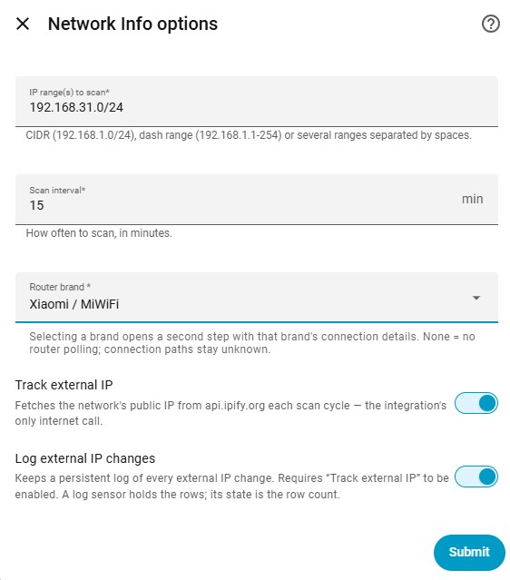

# Setup

## Installing

**HACS** → three-dot menu → _Custom repositories_ → add
`https://github.com/Oose97/ha-network-info` as an **Integration**, download it, restart
Home Assistant.

**Manually**: copy `custom_components/network_info` into your
`config/custom_components/` directory and restart.

The `nmap` executable must be available — it is bundled with Home Assistant OS and
Container images; Core/venv installs may need it installed on the host.

## Adding the integration

_Settings → Devices & Services → Add Integration → Network Info._

Setup is two steps. The first covers the basics, pre-filled from Home Assistant's own
network connection:

| Field | Meaning |
|---|---|
| IP range(s) to scan | Anything nmap accepts: CIDR (`192.168.1.0/24`), dash ranges (`192.168.1.1-254`), or several ranges separated by spaces. |
| Scan interval | Minutes between automatic scans. Default 15, allowed 1–1440. A `/24` ping sweep takes a few seconds, so short intervals are harmless. |
| Router brand | **None (scanning only)** by default. Pick your router's brand to get per-device connection paths and signal — the supported brands come from the [router catalog](routers.md#the-brand-catalog). |
| Track external IP | Fetches the network's public IP from `api.ipify.org` each scan cycle and publishes it as a sensor. This is the integration's **only** internet call, and only when enabled. |
| Log external IP changes | Keeps a persistent log of every external IP change. Requires **Track external IP** to be enabled. The log survives restarts and is capped at the newest 500 entries. |

Choosing a brand opens the second step, pre-filled from the catalog. Only the fields
that brand actually needs are shown:

| Field | Meaning |
|---|---|
| Router address | Pre-filled with the brand's usual gateway address; adjust if yours differs. |
| Router username | Only shown for brands that need one. |
| Router admin password | Only shown for brands that need one. |

The credentials are verified against the router before the entry is created:

| Error | Meaning |
|---|---|
| _The router rejected the credentials_ | Login reached the router and was refused. |
| _Could not reach the router at this address_ | Nothing answered the API there. |

Scan-only mode (brand None) still discovers, remembers and names devices — only the
path/signal columns stay empty until a router brand is configured.

## Access points

If your network has downstream access points — a mesh node, a second router in
AP mode, a dedicated AP — the main router cannot tell you how their clients are
connected. Every device behind one arrives over a wired port, so the gateway
honestly reports it as LAN.

Add each one on the integration card with **Add access point**. They are
separate from the main setup, so you can add, edit or remove one at a time
without touching anything else.

| Field | Meaning |
|---|---|
| Name | How the access point appears in the device table, e.g. the room it covers. |
| Brand | Pick a brand to poll it for connected devices. **None** declares that it exists without polling it. |
| Address / username / password | Shown once a brand is picked, prefilled from the catalog, verified before the access point is saved. |

Two things change once an access point is added:

- Devices it reports as wireless get that band, its signal, and its name in the
  **Access point** column — the access point's word beats the gateway's, since
  it is the one actually holding the association.
- The gateway's **LAN** verdict is only trusted when every access point has
  been asked and none of them claims the device. If one is unreachable, or was
  added with brand **None**, affected devices read Unknown rather than a
  confident LAN that may be wrong.

That second point is why declaring an access point with brand **None** is
worth doing even for hardware this integration cannot poll yet: it is what
stops wireless clients from being reported as wired.

## Changing settings later

Open the integration's **Configure** dialog — the same form, editing the scan range,
interval and router credentials in place. Saving reloads the integration.

## Multiple networks

One config entry covers one scan-range string; adding a second entry with a different
range gives it its own sensors, memory and card data. The same range cannot be added
twice.

## Scanning on demand

The regular interval keeps running, but an immediate scan is available any time:

- press **Scan now** on the Network Info device (`button.network_info_scan_now`),
- press ↻ in the bundled table card,
- or call `homeassistant.update_entity` on the devices sensor from an automation.
